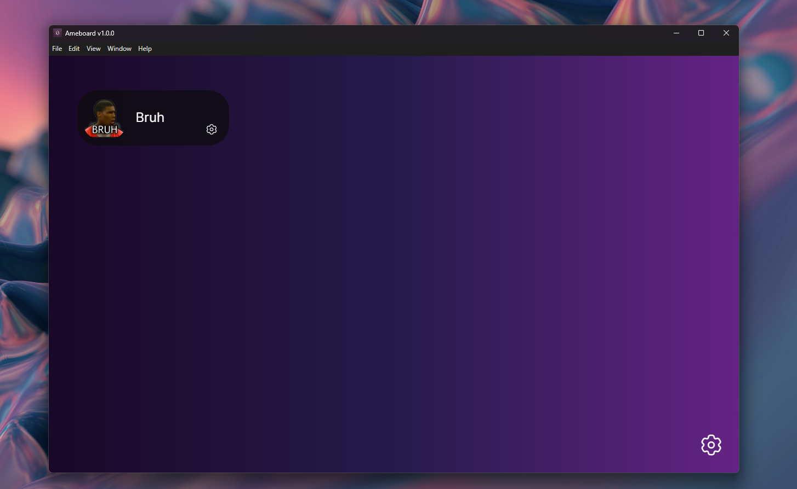

# Ameboard 🔊

A fast soundboard written in Python & Electron.js! 🚀

## Features

- Add custom sound icons
- Change the starting & ending points of sounds
- Modern UI

## Installation

1. Install 
2. Configure it to loopback your main microphone
3. Go to the  tab
4. Download the latest release file
5. Set up the virtual microphone

## Contributing

Feel free to contribute by opening issues or submitting pull requests. Your input is highly appreciated! 🙌

## License

This project is licensed under the [MIT License](https://choosealicense.com/licenses/mit/).
